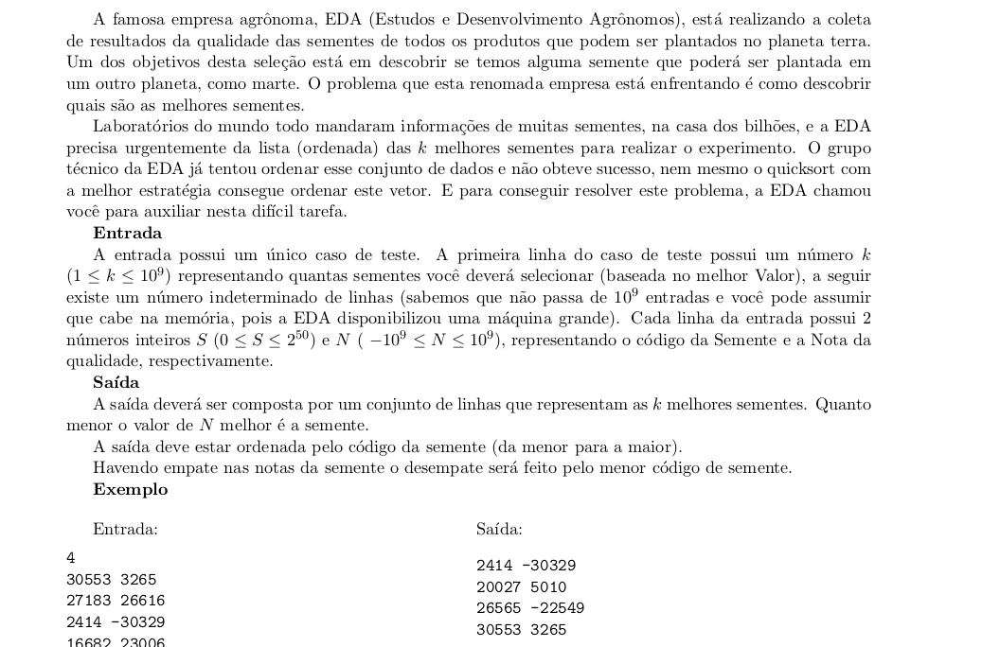
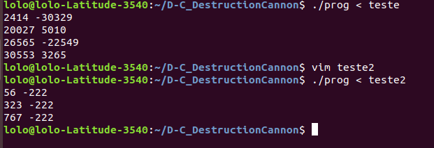
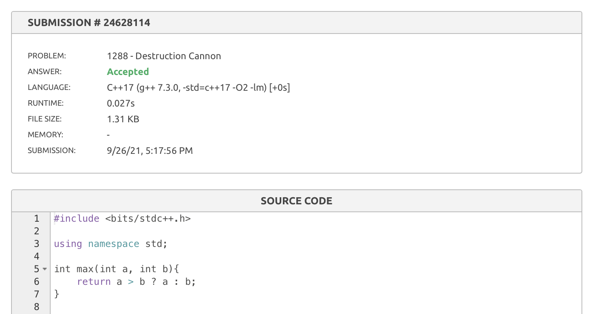
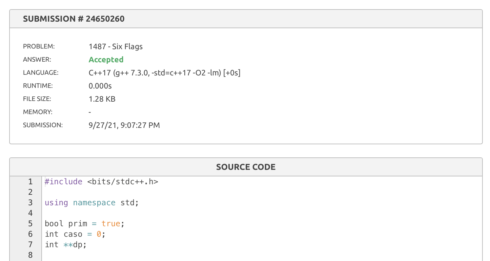

# DestructionCannon

**Número da Lista**: x<br>
**Conteúdo da Disciplina**: Divide and Conquer<br>

## Alunos
|Matrícula | Aluno |
| -- | -- |
| 17/0013651  |  João Gabriel Antunes |
| 16/0132550  |  Lorrany Azevedo |

## Sobre 
Neste projeto nós resolvemos alguns problemas utilizando estratégias de dividir para conquistar, o problema classificados é um problema de uma prova de EDA2, e os problemas Six Flags e Destruction Cannon são problemas da categoria de Paradigmas do URI.

## Screenshots





## Instalação 
**Linguagem**: C, C++<br>
Para rodar o projeto basta ter os compiladores gcc e g++ em sua máquina
## Uso 
Para rodar o problema sementes, basta executar os seguintes comandos no terminal:

```console
gcc sementes.c -o prog
./prog < ./arquivos-de-entrada/teste
./prog < ./arquivos-de-entrada/teste2
```
Para rodar o problema Six Flags, basta executar os seguintes comandos no terminal:

```console
gcc 1487.cpp -o prog
./prog < ./arquivos-de-entrada/1487-entrada.in
```
Para rodar o problema Destruction Cannon, basta executar os seguintes comandos no terminal:

```console
gcc 1288.cpp -o prog
./prog < ./arquivos-de-entrada/1288-entrada.in
```
## Outros 


